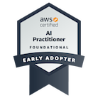
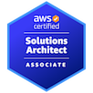
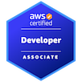
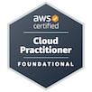

# Tiago do Nascimento Pinto da Silva

## 👨‍💻‍🏫 Líder de Tecnologia aplicada a SaaS

> Especialista em Concepção e Evolução de Soluções SaaS | Da Inovação à Sustentação

### 📋 Resumo Executivo
- 20+ anos de experiência com Tecnologia da Informação
- Direção de times multidisciplinares com mais de 40 profissionais
- Especialista em Cloud Computing (estratégico, tático e operacional)
- Concepção e implementação de arquiteturas distribuídas escaláveis (System
Design)
- Gestão de evolução e sustentação de sistemas legados
- Liderança orientada a dados em Cloud, Produtividade e Engenharia de Software
- Implementação de IA para automação, produtividade e enriquecimento de
produtos
- Experiência com metodologias ágeis e gestão de transformação digital

## 📚 Índice de Repositórios

### ✨ Inteligência Artificial / GenAI

* [genai-app-mcp-jira-github](https://github.com/tiagonpsilva/genai-app-mcp-jira-github) - Aplicação de IA Generativa integrando dados do Jira e GitHub para apoio aos processos de engenharia de software
* [genai-mcp-client-claude-github](https://github.com/tiagonpsilva/genai-mcp-client-claude-github) - Cliente para integração Claude/GitHub
* [genai-mcp-server-demo](https://github.com/tiagonpsilva/genai-mcp-server-demo) - Servidor demo para GenAI MCP
* [genai-langchain-tutorial](https://github.com/tiagonpsilva/genai-langchain-tutorial) - Tutorial sobre LangChain para IA Generativa
* [genai-prompts-collection](https://github.com/tiagonpsilva/genai-prompts-collection) - Coleção de prompts úteis para uso com LLMs

### 🧪 Desenvolvimento e Exemplos de Código

* [go-lang-samples](https://github.com/tiagonpsilva/go-lang-samples) - Exemplos de código em Go
* [arch-concepts](https://github.com/tiagonpsilva/arch-concepts) - Conceitos e exemplos de arquitetura de software

### 🛠️ Ferramentas e Utilitários

* [plantuml-2-png](https://github.com/tiagonpsilva/plantuml-2-png) - Utilitário para gerar arquivos PNG a partir de diagramas PlantUML (.wsd)
* [mysql-migration-dbs](https://github.com/tiagonpsilva/mysql-migration-dbs) - Scripts para auxiliar em operações de infraestrutura de bancos de dados MySQL

### 📝 Documentação e Base de Conhecimento

* [knowledge-base](https://github.com/tiagonpsilva/knowledge-base) - Base de conhecimento pessoal
* [tiagonpsilva](https://github.com/tiagonpsilva/tiagonpsilva) - Perfil GitHub

## 🏆 CERTIFICAÇÕES

### ☁️︎ AWS
- AWS Certified Solutions Architect - Associate
- AWS Certified Developer - Associate
- AWS Certified Cloud Practitioner
- AWS Certified AI Practitioner (Early Adopter)
- Participante de 4 edições do AWS re:Invent (USA)

   

### 🔄 Metodologias Ágeis
- Kanban Management Professional (KMP) - Kanban University
- Customer Experience Professional (CXP) - Kanban University
- Flight Levels Systems Architecture (FLSA) - Flight Levels Academy

## 🌎 EVENTOS INTERNACIONAIS

### 🇺🇸 EUA
- AWS re:Invent 2020,2022,2023,2024
- Google Next 2025

## 💼 Contato

